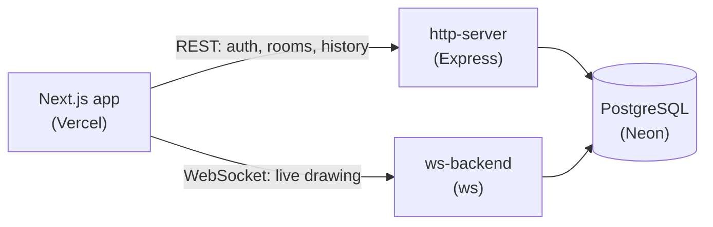

<div align="center">

# CollabSketch

**A real-time collaborative whiteboard, inspired by Excalidraw.**
Sketch on your own, or draw together with your team, live.

[Live demo](https://collab-sketch-docs-wwrb.vercel.app)


</div>

> The demo runs on free hosting, so the first request can take about a minute while the servers wake up.

## Features

- Draw with rectangles, diamonds, circles, arrows, lines, a freehand pencil, text and an eraser
- **Solo mode**: no account needed, saved automatically in the browser
- **Collab rooms**: create or join by name, shapes appear live for everyone, history loads on join
- Only the room creator can clear the room for everyone; participants only clear their own screen
- Invite links, Save as PNG, JWT auth with expiring tokens, input validated with shared zod schemas

## Tech stack

Next.js, React, TypeScript, Tailwind, shadcn/ui — Express, `ws` — PostgreSQL (Neon) with Prisma 7 — Turborepo + pnpm — deployed on Vercel and Render

## Architecture



Every shape is a small typed object, e.g. `{ type: "rect", x, y, w, h }`. The same object is used for drawing, solo-mode storage, the WebSocket message, and the database row. A shape draws instantly on the sender's screen, then is sent to the server, saved, and forwarded to everyone else in the room.

**WebSocket messages:** `join_room`, `chat` (a shape), `erase`, `clear` — and `role`, sent back to tell a client if it's the room admin.

**REST API:** `POST /signup`, `POST /signin`, `POST /room`, `GET /room/:slug`, `GET /chats/:roomId`, `GET /health`.

## Project structure

```
apps/
  docs/         # Next.js frontend
  http-server/  # Express REST API
  ws-backend/   # WebSocket server
packages/
  common/           # shared zod schemas
  backend-common/   # shared server config
  db/               # Prisma schema and client
```

## Running it locally

```bash
pnpm install
```

Create `.env` files with `DATABASE_URL` (a PostgreSQL connection string) in `apps/http-server`, `apps/ws-backend`, and `packages/db`, plus a shared `JWT_SECRET` in the first two. Then:

```bash
pnpm --filter @repo/db exec prisma migrate deploy
pnpm --filter @repo/db exec prisma generate
pnpm dev
```

| Service | URL |
| --- | --- |
| Frontend | http://localhost:3002 |
| REST API | http://localhost:3003 |
| WebSocket | ws://localhost:8000 |

## Deployment

Frontend on Vercel (root directory `apps/docs`), the two backends as separate Render web services sharing one `JWT_SECRET` and `DATABASE_URL`, database on Neon. A cron job pings `/health` every 10 minutes to keep the free API instance awake.

## Roadmap

- [ ] Automatic WebSocket reconnect
- [ ] Stroke color and width panel, undo/redo, zoom
- [ ] Private rooms with invite codes

## License

MIT

---

Built by [@Rumman963](https://github.com/Rumman963), inspired by [Excalidraw](https://excalidraw.com).